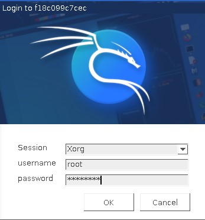
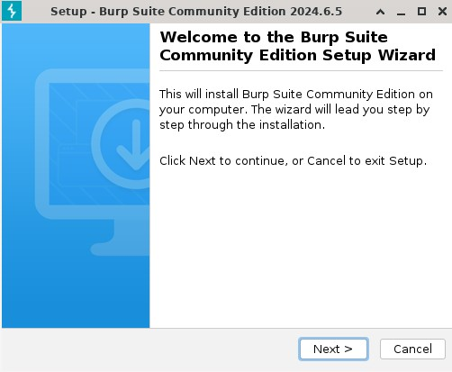
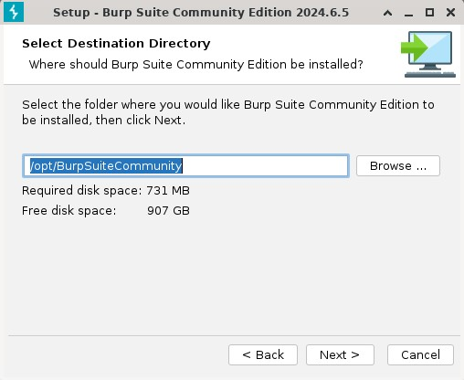
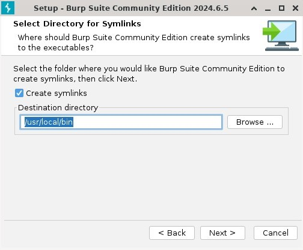
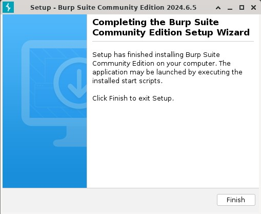

# Hacking-Lab
## 概要
このハッキング・ラボはDockerコンテナ環境に攻撃サーバと被攻撃サーバを構築し、  
ハッキングの学習に役立てることを目的としている。  
攻撃サーバ：  
    KaliLinux  

被攻撃サーバ：  
    DVWA  
    JuiceShop  
    Metasploitable2  

## 実行環境
プロセッサ：Intel64 Family
OS：Windows11 Home  
WSL2  
WSL2上のOS：Ubuntu 22.04.3 LTS  
Docker：Docker version 27.0.3  


## 利用ツール
Metasploit Framework  
BurpSuite  
Windows リモートデスクトップ

## 前提条件
本手順はUbuntu上で実行する。  
dockerはセットアップ済みであること。  

## Dockerコンテナ起動
1. リポジトリをクローン  
*git clone git@github.com:sato-kojiro/hacking-lab*  
2. Dockerコンテナを起動
*cd ./hacking-lab && docker-compose up -d*  

## Metasploit Frameworkの設定
1. コンテナにログイン
```
docker exec -it kali-linux bash
```
2. postgresの設定  
下記コマンドを実行  
*cd /opt/metasploit/metasploit-framework*  
*cp -p config/database.yml.example config/database.yml*  
*vi database.yml*  
database.ymlの項目修正  

| 項目 | 修正前 | 修正後 |
|-|-|-|
| database | metasploit_framework_development | msf |
| username | metasploit_framework_development | msf |
| password: | __________________________________ | password |
| host: | localhost | postgres |

修正後のdatabase.yml抜粋  
```
development: &pgsql
  adapter: postgresql
  database: msf
  username: msf
  password: password
  host: postgres
  port: 5432
  pool: 200
  timeout: 5
```

3. metasploitアップデート
*git config --global user.name "{usrename}"*  
*git config --global user.email "{email}"*  
*./msfupdate*

4. metasploit起動
*./msfconsole*  
*db_status*  
db_statusの実行結果  
```  
[*] Connected to msf. Connection type: postgresql.  
```  
        *exit*

## rootユーザのパスワード設定
1. passwdを実行  
*passwd*  
任意のパスワードを設定する。  
*exit*  
※コンテナからログアウトする。
## BurpSuiteのインストール
1. BurpSuiteのインストーラーダウンロード  
こちらのURLにアクセスして、stable版の"Burp Suite Community Edition"の"Linux(x64)"を選択しインストーラーをダウンロードする。  
https://portswigger.net/burp/releases  

2. docker上にBurpSuiteのインストーラーをコピー  
*docker cp ~/burpsuite_community_linux_v2024_6_5.sh kali-linux:/root/*  
※"burpsuite_community_linux_v2024_6_5.sh"は8/10時点のStable版のBurpsuiteのインストーラーになります。  

3. リモートデスクトップからKaliLinuxにログイン  
Widowsキー＋Rを実行して"mstsc"と入力し、Enterをクリックする。  
リモートデスクトップ接続の"接続"ボタンをクリックする。  
usernameに"root"を入力し、passwordにrootユーザのパスワードを設定し、"OK"ボタンをクリックする。  
  

4. BurpSuiteのインストール  
KaliLinuxのデスクトップ下部のコンソールアイコンをクリックする。  
*/bin/sh /root/urpsuite_community_linux_v2024_6_5.sh*  
"Next >"ボタンをクリックする。  
  
"Next >"ボタンをクリックする。  
  
"Next >"ボタンをクリックする。  
  
"Finish"ボタンをクリックする。  
  
*exit*

これでハッキング・ラボの構築は完了です。

## 参考URL
[DockerでKali Linuxコンテナをインストール](https://qiita.com/osa-osa/items/a175235409a34773c2c6)  
[Ubuntu 20.04にMetasploit 6.0のインストールと設定方法](https://note.com/shimakaze_soft/n/nb0c9f03f3451)  
[【備忘録】KaliLinuxにBurpSuiteをインストールして起動](https://qiita.com/natsuki7293/items/74ab17ad3ad1d8a8ec3d)  
こちらのURLを参考にさせていただきました。  
ありがとうございました。
